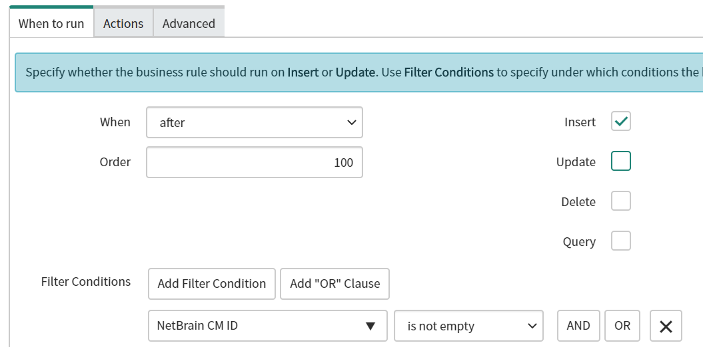
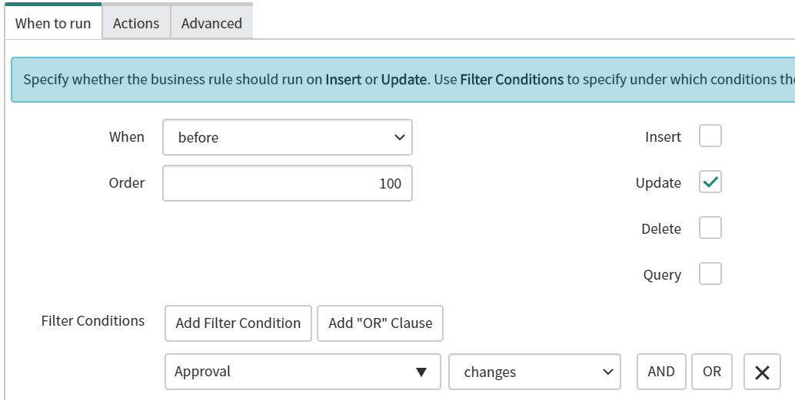
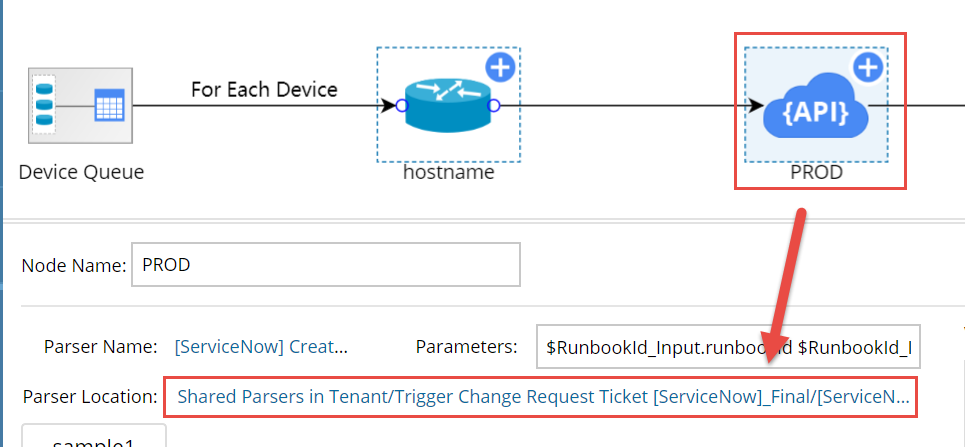
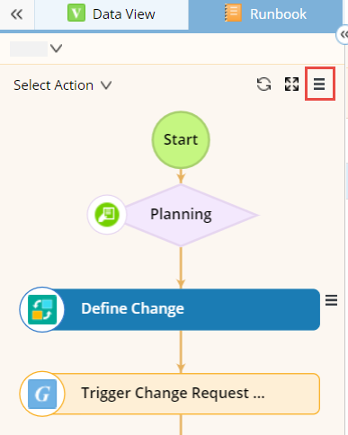
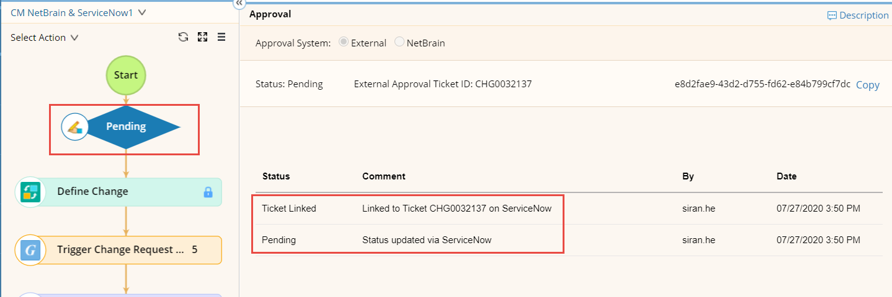
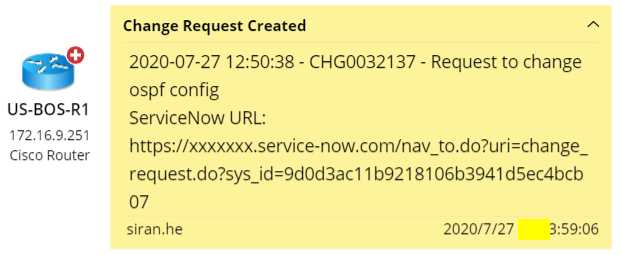

**Description** 
================

Managing network changes can be a challenging task for network engineers during
regular maintenance, which is prone to human errors and requires seamlessly
planning, implementation and verification. Based on Network Change Management
Approval Process Runbook and ticketing system Integration, NetBrain provides the
best practices of change management process and workflow to ensures a safer
network change task. During this workflow, NetBrain Change executor and
ServiceNow Change approver are fully isolated which means they are not necessary
to have access cross systems. In this document, NetBrain integrate with
ServiceNow change request ticketing system as an example.

**Workflow** 
================
.png)

**Requirements** 
=================

2.1 Application Version
-----------------------

| Application                 | Version            |
|-----------------------------|--------------------|
| NetBrain Integrated Edition | IE v8.0 (or above) |
| ServiceNow                  | Madrid, New York   |

2.2 User Account Pre-Requisites
-------------------------------

-   NetBrain: NetBrain requires a user account with the following privilege
    level be available in the NetBrain system to execute Change Management
    Approval Process Runbook.

| **User Account**  | **NetBrain Domain Privilege Level (Minimum)**            |
|-------------------|----------------------------------------------------------|
| **Standard User** | Create Network Change & Execute Network Change privilege |
| **Admin User**    | System Admin                                             |

-   ServiceNow: NetBrain requires a ServiceNow admin user account to create a
    custom field in “Change request” table to save NetBrain Runbook ID and
    create 2 Business Rules

2.3 Connection Pre-Requisites
-----------------------------

| From       | To         | Server             | Protocol   |
|------------|------------|--------------------|------------|
| NetBrain   | ServiceNow | Web/Web API Server | HTTP/HTTPS |
| ServiceNow | NetBrain   | Cloud              | HTTP/HTTPS |

2.4 Device Hostname
-------------------

Hostnames of devices in ServiceNow match the hostnames in NetBrain.

**Deployment in ServiceNow**
============================

3.1 Create a new field in ServiceNow Change Request Table
---------------------------------------------------------

NetBrain is using the unique Runbook ID to bind NetBrain Change Management
Runbook and ServiceNow Change request ticket. So that, NetBrain requires a new
field in ServiceNow Change Request table to save Runbook ID.

1.  Search “**System Definition - Tables**” In ServiceNow navigation bar, click
    it to get table list on right panel

2.  Search the table name “**Change Request**” and then click it

3.  Under the “**Columns**” Tag, click “**New**” to create a new field

4.  Provide following information to create a new field:

-   Table: Change **Request[change_request]**

-   Type: **String**

-   Column label: **NetBrain CM ID**

-   Column name: **u_netbrain_cm_id** (It will be auto generated)

-   Max length: **100**

-   Active: check the checkbox

3.2 Create Business Rules in ServiceNow
---------------------------------------

In this step, ServiceNow admin need to create two Business Rules in order to
bind NetBrain Runbook to the ServiceNow ticket and update the Change request
decision to NetBrain.

#### 3.2.1 Create a Business Rule to Bind NetBrain Change Management Approval Runbook to ServiceNow Change Request ticket

1.  Search “**System Definition – Business Rules**” in ServiceNow navigation bar

2.  Click “**New**” button on under the Business Rules list

3.  Provide following information to create a new rule:

-   Name: **NetBrain CM Bind**

-   Table: Change **Request[change_request]**

-   Active: check the checkbox

-   Advance: check the checkbox

-   Under the “**When to run**” tag

-   When: **after**

-   Order: **100**

-   Insert: check the checkbox

-   Filter Conditions: **NetBrain CM ID is not empty**

    

-   Under the “**Advance**” tag**:** Copy the code **NetBrain CM Bind.js** from
    GitHub and paste it in here.

#### 3.2.2 Create a Business Rule to update NetBrain Change Management Approval Runbook Decision

1.  Search “**System Definition – Business Rules**” in ServiceNow navigation bar

2.  Click “**New**” button on under the Business Rules list

3.  Provide following information to create a new rule:

-   Name: **NetBrain CM Update**

-   Table: Change **Request[change_request]**

-   Active: check the checkbox

-   Advance: check the checkbox

-   Under the “**When to run**” tag

-   When: **before**

-   Order: **100**

-   Update: check the checkbox

-   Filter Conditions: **Approval changes**

    

-   Advance**:** Copy the code **NetBrain CM Update.js** from GitHub and paste
    it in here.

**Deployment in NetBrain**
==========================

4.1 Create an API Adapter
-------------------------

Create an API Adapter in NetBrain to define the function template for the API
Parser and API Server to work with ServiceNow. In this step, NetBrain provides a
template which includes GET, POST and PUT function to send API call to
ServiceNow.

1.  Login to NetBrain **System Management** page with an account that has
    **System admin** privilege.

2.  Click “**Operations**” on top of the right and navigate to “**API
    Adapters**”

3.  Under the **API Adapters list**, click **“+Add**” to create a new API
    Adapter and input name as “**ServiceNow API Adapter**”

    Note: If **ServiceNow API Adapter** is already existing in the list, please
    skip this step

4.  Click “**Import**” to import the **ServiceNow API Adapter.py** script

    Note: ServiceNow API Adapter.py file can be downloaded from GitHub.

5.  Click “**Save**” to create API Adapter.

4.2 Add an External API Server in API Server Manager
----------------------------------------------------

The API Server Manager is used to define the required parameters for API
Adapters to interact with API servers, such as endpoints and credentials for an
API adapter to access your third-party system.

1.  Login to NetBrain **Domain Management** page with an account that has
    **Domain Management** privilege.

2.  Click “**Operations”** on top of the right and navigate to “**API Server
    Manager”**

    *Operations \> Discover Settings \> API Server Manager*

3.  Under the API Server Manager tab, click “**+Add**” button to create a new
    connection.

4.  Enter the **Server Name** and **Description**.

5.  In the **API Source Type** field, select the **ServiceNow API Adapter**.

6.  In the **Endpoint** field, enter the ServiceNow instance.

7.  Enter the username and password to access the ServiceNow instance.

8.  Select a Front Server that has HTTP(HTTPS) access of ServiceNow instance

9.  Click “**Test**” to check the connection

    Note: NetBrain will return the message “Endpoint and credentials are
    verified” once connection has been setup.

10. Click “**OK”** to submit the change

4.3 Setup Change Management Approval Settings to Support External Approval Workflow
-----------------------------------------------------------------------------------

By Default, user can only make the approval process inside of NetBrain. In order
to integrate with an external ticket system and approve the task in the external
system, user need to change Approval Settings in Domain Management page.

1.  Login to NetBrain **Domain Management** page with an account that has
    **Domain Management** privilege.

2.  Click “**Operations”** on top of the right and navigate to “**Change
    Management Settings”**

    *Operations \> Domain Settings \> Change Management Settings*

3.  Under the **Approval Settings**, check the checkbox of “**External Approval
    System”**

4.  Click “**Submit**” to save the change

4.4 Import and Modify **[ServiceNow] Trigger Change Request Ticket** Gapp 
--------------------------------------------------------------------------

### 4.4.1 Import [ServiceNow] Trigger Change Request Ticket Gapp

1.  Log into the NetBrain End User Interface 

>   *https://\<NetBrain IP Address or Hostname\> * 

1.  From the main user interface desktop, navigate to the NetBrain **Gapp
    Center** 

>   *Start Menu \> Automation \> Gapp Center* 

1.  Right-Click “**Shared Gapps in Tenant”** folder, then click “**New
    Folder”** 

2.  Name the folder as “**ServiceNow CM”**

3.  Right-click the “**ServiceNow CM”** folder, and then click “**Import
    Gapp” **

4.  In the Import Gapp dialog, click “**Add Gapp…**” 

5.  Select the **[ServiceNow] Trigger Change Request Ticket.Gapp** file, and
    then click “**Import”** 

>   Note: The Gapp can be downloaded from GitHub 

1.  Click “**Import**” to initiate import of the custom Gapp to
    the NetBrain system 

>   **Note: **On successful completion, the status will transition
>   from *Ready* to *Succeed.* If any other status is reported, retry the
>   operation, then contact NetBrain support 

1.  Click “**Finish**” to complete import of the **[ServiceNow] Trigger Change
    Request Ticket.Gapp** 

2.  Close the NetBrain Gapp Center and return to the main user interface
    desktop 

    1.  Modify [ServiceNow] Trigger Change Request Ticket Gapp

        1.  Select a sample device to assign API Server to send API call

            Creating ticket from NetBrain to ServiceNow is a part of Gapp in
            Change Management Approval process, NetBrain needs to send API call
            through an API Server that user specified in step 4.2, therefore,
            the user needs to pick a sample device, assign the API Server to the
            sample device and add that sample device name into the Gapp. After
            that, NetBrain will send API calls to create ServiceNow ticket
            through the sample device’s API Server Settings. Please note, in
            this step, it only needs to configure once until the sample device’s
            hostname or assigned API Server has any changes.

#####  Select a sample device and assign the API Server that specified in Step 4.2

1.  Login to NetBrain **Domain Management** page with an account that has Domain
    Management privilege.

2.  Click “**Operations”** on top of the right and navigate to “**API Server
    Manager”**

    *Operations \> Discover Settings \> API Server Manager*

3.  Select the API Server that created on step 4.2 and then right click to
    **Edit** it

4.  Click “**Managed Devices**” to get managed device list

5.  Click “**+ Device**” to add sample device into **Selected** list

6.  Click “**Ok**” to save the change

>   Update sample device name in Gapp

1.  Log into the NetBrain End User Interface 

    *https://\<NetBrain IP Address or Hostname\> * 

2.  From the main user interface desktop, navigate to the NetBrain **Gapp
    Center** 

    *Start Menu \> Automation \> Gapp Center*

3.  From the Gapp Center navigate to **[ServiceNow] Trigger Change Request
    Ticket** Gapp

>   *Shared Gapps in Tenant \> ServiceNow CM \> [ServiceNow] Trigger Change
>   Request Ticket*

1.  Double click to open the Gapp

2.  Right Click on the first Qapp **Change Management – ServiceNow [Trigger
    Ticket]** and **Open** the Qapp

3.  Click the Green table Icon “**Global Table**” to get **deviceQueue** list in
    the bottom and then double click “**US-BOS-R1**”, change it to sample device
    hostname

    

4.  Click “**Save**” icon on top of the right to save the change

    1.  Select API Adapter in API Parser

There are 2 API parsers in the Gapp, user need to select the API Adapter in each
parser.

1.  Following the last step to open the **[ServiceNow] Trigger Change Request
    Ticket** Gapp

2.  Right Click on the first Qapp **Change Management – ServiceNow [Trigger
    Ticket]** to **Open** it

3.  Inside of the Qapp, double click the “**Change”** Canvas to open it

    

4.  Click the API node **PROD**, and then click the linked parser in Parser
    Location

    

5.  NetBrain will point to the folder that two parsers are saved in Parser
    Library. It includes **[ServiceNow] Create Change Request – PROD** parser
    and **[ServiceNow] Create Change Request - PROD [Add CIs]** parser

6.  Double click **[ServiceNow] Create Change Request – PROD** to open the
    parser

7.  Click the drop-down list right next to **Parser Type** and select
    “**ServiceNow API Adapter**” as API template

    

8.  Click the save icon on top of the right to save the change

9.  Close the parser

10. Repeat the step6-8 to modify the **[ServiceNow] Create Change Request - PROD
    [Add CIs]** parser

11. Import and Modify **[ServiceNow] Set Actual Start Time** Qapp and
    **[ServiceNow] Close Change Request Ticket** Qapp

    1.  Import **[ServiceNow] Set Actual Start Time** Qapp and **[ServiceNow]
        Close Change Request Ticket** Qapp

12. Log into the NetBrain End User Interface. 

>   *https://\<NetBrain IP Address or Hostname\> * 

1.  From the main user interface desktop, navigate to the NetBrain **Qapp
    Center** 

>   *Start Menu \> Automation \> Qapp Center* 

1.  Right-Click “**Shared Qapps in Tenant”** folder, then click “**New
    Folder**” 

2.  Name the folder as “**ServiceNow CM**” 

3.  Right-click the “**ServiceNow CM**” folder, then click “**Import Qapp**”

4.  In the Import Qapp dialog, click “**Add Qapp…**” 

5.  Select the **[ServiceNow] Set Actual Start Time.xapp** file and
    **[ServiceNow] Close Change Request Ticket.xapp** file, then click
    “**Import**” 

>   Note: Those two Qapps can be downloaded from GitHub

1.  Click “**Import**” to initiate import of the custom Qapps to
    the NetBrain system 

>   **Note: **On successful completion, the status will transition
>   from *Ready* to *Succeed.* If any other status is reported, retry the
>   operation, then contact NetBrain support 

1.  Click “**Finish**” to complete import of two Qapps

2.  Close the NetBrain Qapp Center and return to the main user interface
    desktop 

    1.  Modify **[ServiceNow] Set Actual Start Time** Qapp and **[ServiceNow]
        Close Change Request Ticket** Qapp

#### 4.5.2.1 Modify [ServiceNow] Set Actual Start Time Qapp

1.  Open the **[ServiceNow] Set Actual Start Time** Qapp

    *Start Menu \> Automation \> Qapp Center* \> ServiceNow CM \> [ServiceNow]
    Set Actual Start Time

2.  Double click the **implement_ticket** Canvas and open it

3.  Click the API node **implement_tickct** and then click the linked parser in
    Parser Location

4.  NetBrain will point to the folder that parser saved in Parser Library

5.  Double click to open the **[ServiceNow] Implement Change Request** parser

6.  Click the drop-down list right next to Parser Type and select “**ServiceNow
    API Adapter**” as API templet

7.  Click the save icon on top of the right to save the change

8.  Close the parser

#### 4.5.2.2 Modify [ServiceNow] Set Actual Start Time Qapp

1.  Open the **[ServiceNow] Close Change Request Ticket** Qapp

    *Start Menu \> Automation \> Qapp Center* \> ServiceNow CM \> [ServiceNow]
    Close Change Request Ticket

2.  Double click the **close_ticket** Canvas and open it

3.  Click the API node **close_tickct** and then click the linked parser in
    Parser Location

4.  NetBrain will point to the folder that parser saved in Parser Library

5.  Double click to open the **[ServiceNow] Close Change Request Ticket** parser

6.  Click the drop-down list right next to Parser Type and select “**ServiceNow
    API Adapter**” as API template

7.  Click the save icon on top of the right to save the change

8.  Close the parser

9.  Create ServiceNow Change Management Approval Process Runbook Template

    1.  Create a build-in Change Management Runbook

10. Log into the NetBrain End User Interface 

>   *https://\<NetBrain IP Address or Hostname\> * 

1.  From the main user interface desktop, navigate to the NetBrain **Network
    Change** module  

>   *Start Menu \> Network Change*

1.  Click “**+ New Network Change**”

2.  Provide a Runbook Template name and select “**Default Template**” in
    **Change Template** field.

    1.  Add [ServiceNow] Trigger Change Request Ticket Gapp to the Runbook
        Template

3.  Open on Default Network Change Templates that created in step 5.1, click the
    green plus icon under the “**Define Change**” node.

    

4.  Select “**Run Gapp”** and click “**Add”** to add a new action into the
    Runbook.

    *Select Action \> Built-in \> Run Gapp*

5.  Select the **[ServiceNow] Trigger Change Request Ticket** Gapp and click
    “**OK”**

    *All Gapps \> Shared Gapps in Tenant \>* ServiceNow CM \> [ServiceNow]
    Trigger Change Request Ticket

    1.  Add [ServiceNow] Set Actual Start Time Qapp to the Runbook Template

6.  Based on the customized Runbook that complete in step 5.2, click the green
    plus icon under the “**Benchmark Before**” node.

7.  Select “**Run Qapp”** and click “**Add**” to add a new action into the
    Runbook.

    *Select Action \> Built-in \> Run Qapp*

8.  Select the **[ServiceNow] Set Actual Start Time** Qapp and click “**OK**”

    *All Qapps \> Shared Qapps in Tenant \>* ServiceNow CM \> [ServiceNow] Set
    Actual Start Time

    1.  Add [ServiceNow] Close Change Request Ticket Qapp to the Runbook
        Template

9.  Based on the customized Runbook that complete in step 5.3, click the green
    plus icon under the “**Compare**” node

10. Select “**Run Qapp”** and click “**Add”** to add a new action into the
    Runbook.

    *Select Action \> Built-in \> Run Qapp*

11. Select the **[ServiceNow] Set Actual Start Time** Qapp and click “**OK**”

    *All Qapps \> Shared Qapps in Tenant \>* ServiceNow CM \> [ServiceNow] Close
    Change Request Ticket

    1.  Save the Network Change Template

12. Under the Runbook tab, click the three lines icon to get more options.

    

13. Select “**Save as Network Change Template**” option and then click
    “**Save**” button in the bottom

14. Click “**Shared Templates**” and provide a name as **CM NetBrain &
    ServiceNow**

15. Click “**OK**” to save it

16. Run ServiceNow Change Management Approval Process Runbook Template

    1.  Open the **CM NetBrain & ServiceNow Network** Template

17. Log into the NetBrain End User Interface.

    *https://\<NetBrain IP Address or Hostname\>*

18. From the main user interface desktop, navigate to the NetBrain **Network
    Change** module

    *Start Menu \> Network Change*

19. Click “**Network Change Templates**” and then select “**CM NetBrain &
    ServiceNow**”

    *Network Change Templates Shared Templates \> CM NetBrain & ServiceNow*

20. Click “**Create Network Change**” to create a new Runbook

    1.  Define Change

>   This is a built-in feature. The Define Change node is to define target
>   devices and commands to execute on the target devices.

Click
[here](https://www.netbraintech.com/docs/ie80/help/index.html?define-network-change.htm)
to get more detail information

Run [ServiceNow] Trigger Change Request Ticket Gapp
---------------------------------------------------

>   In this step, NetBrain will do following things:

1.  Create a Change request ticket in ServiceNow with following information

-   Runbook ID

    *The Runbook ID will auto send to ServiceNow and update “NetBrain CM ID”
    field in ServiceNow Change Request ticket. There is no input information or
    other action needed.*

-   Request by

    *The NetBrain user need to specify the change request username before
    running the Gapp, it will update “Requested by” field in ServiceNow Change
    Request ticket.*

-   Short Description

    *The NetBrain user need to provide a short description before running the
    Gapp, it will update “Short description” field in ServiceNow Change Request
    ticket.*

-   Description

    *The NetBrain user need to provide description before running the Gapp, it
    will update “Description” field in ServiceNow Change Request ticket.*

-   Planned Start Date

    *The NetBrain user need to provide Planned Start Date before running the
    Gapp, it will update “Planned start date” field under the “Schedule” tab in
    ServiceNow Change Request ticket.*

    *Date and time format: YYYY-MM-DD HH:MM:SS Example: 2020-06-19 13:02:02*

    *Note: The ticket will create failed if “Panned End Date” is earlier than
    “Planned Start Date”*

-   Planned End Date

    *The NetBrain user need to provide Planned End Date before running the Gapp,
    it will update “Planned end date” field under the “Schedule” tab in
    ServiceNow Change Request ticket.*

    *Date and time format: YYYY-MM-DD HH:MM:SS Example: 2020-06-19 13:01:02*

    *Note: The ticket will create failed if “Panned End Date” is earlier than
    “Planned Start Date”.*

-   Add Configuration Items into Change request ticket

    *The NetBrain user need to add all affected devices from Gapp execution
    detail panel before running the Gapp, those affected devices will be added
    into “Affected CI” tab in ServiceNow Change Request ticket.*

    

1.  Bind NetBrain Runbook to the ServiceNow Change request ticket by using
    NetBrian unique Runbook ID.

    *After running this Gapp, NetBrain will bind the Runbook to ServiceNow
    Change request ticket, NetBrain user can always click the status node
    (diamond node) to check Runbook change request status.*

    

2.  NetBrain create a Map Note to provides ticket creation result which includes
    ticket creation time, ticket number etc.

    

>   Note: NetBrain user need to select “**Pull live data once**” as a Data
>   Source before running this Gapp

NetBrain user waiting for change request result 
------------------------------------------------

>   ServiceNow users get the ticket and update the change request decision in
>   the ticket. It will trigger a ServiceNow rule to update the decision in
>   NetBrain corresponding Runbook by using NetBrain API call. NetBrain user got
>   request Approved and then process to the next step.

>   Note: The NetBrain user can only Execute the change after the Runbook get
>   Approved.

Benchmark Before
----------------

>   This is a built-in feature. The Benchmark Before node is used to store the
>   live data of the involved devices before the task implementation.
>   Additionally, the data will be used as the source for data comparison before
>   and after executing the change management task.

>   Click
>   [here](https://www.netbraintech.com/docs/ie80/help/index.html?define-benchmark-before.htm)
>   to get more detail

Run [ServiceNow] Set Actual Start Time Qapp
-------------------------------------------

>   In this Qapp the required input is Change Request

>   This is a required field before running the Qapp. The NetBrain user need to
>   copy ticket number from first Map Note that generate by step 6.3, and then
>   paste into Change Request field.

>   In this Qapp, NetBrain will update the following information into a Change
>   request ticket in ServiceNow.

1.  Work Notes

    NetBrain user need to put all work notes in this field before running the
    Qapp. It will update “**Work notes**” field under the “**Notes**” tab in
    ServiceNow Change Request ticket.

2.  Change the Sate to Implement and set Actual start time

    No input needed, NetBrain will change the “**State”** field to
    “**Implement**” and update “**Actual start**” field under the
    “**Scheduled**” tab in ServiceNow Change Request ticket.

    1.  Execute

>   This is a built-in feature. The Execute node is used to implement one of the
>   defined changes on devices.

>   Click
>   [here](https://www.netbraintech.com/docs/ie80/help/index.html?define-the-execute.htm)
>   to get more detail information

Benchmark After 
----------------

>   This is a built-in feature. This is a built-in feature. The Benchmark After
>   node is used to collect network data after the change is implemented, thus
>   verify if the change has been deployed successfully. Additionally, the
>   benchmark results will be used to compare with the data collected in the
>   Benchmark Before node.

>   Click
>   [here](https://www.netbraintech.com/docs/ie80/help/index.html?define-benchmark-after.htm)
>   to get more deatil information

Compare 
--------

>   This is a built-in feature. The Compare node is used to compare the data
>   between Benchmark before and Benchmark after to verify the changes.

>   Click
>   [here](https://www.netbraintech.com/docs/ie80/help/index.html?define-compare.htm)
>   to get more detail information

Run [ServiceNow] Close Change Request Ticket Qapp
-------------------------------------------------

>   In this Qapp the required input is Change Request

>   This is a required field before running the Qapp. The NetBrain user need to
>   copy ticket number from first Map Note that generate by step 6.3, and then
>   paste into Change Request field.

>   In this Qapp, NetBrain will update the following information into a Change
>   request ticket in ServiceNow.

1.  Close Code

    NetBrain user need to select a Close Code from the drop-down list before
    running the Qapp. It will update “**Close code**” field under the “**Closure
    Information**” tab in ServiceNow Change Request ticket.

2.  Close Notes

    NetBrain user need to put all close notes in this field before running the
    Qapp. It will update “**Close notes**” field under the “**Closure
    Information**” tab in ServiceNow Change Request ticket.

3.  Work Notes

    NetBrain user need to put all work notes in this field before running the
    Qapp. It will update “**Work notes**” field under the “**Notes**” tab in
    ServiceNow Change Request ticket.

4.  Change the Sate to Review and set Actual end time

    No input needed, NetBrain will change the “**State”** field to “**Review**”
    and update “**Actual end**” field under the “**Scheduled**” tab in
    ServiceNow Change Request ticket
